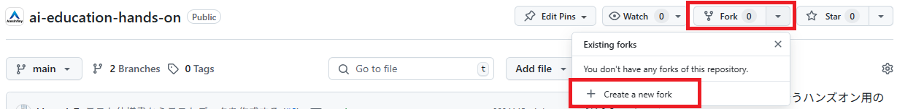
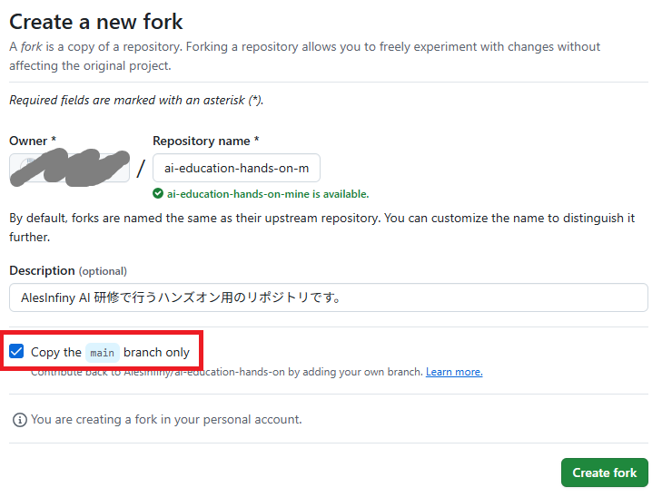
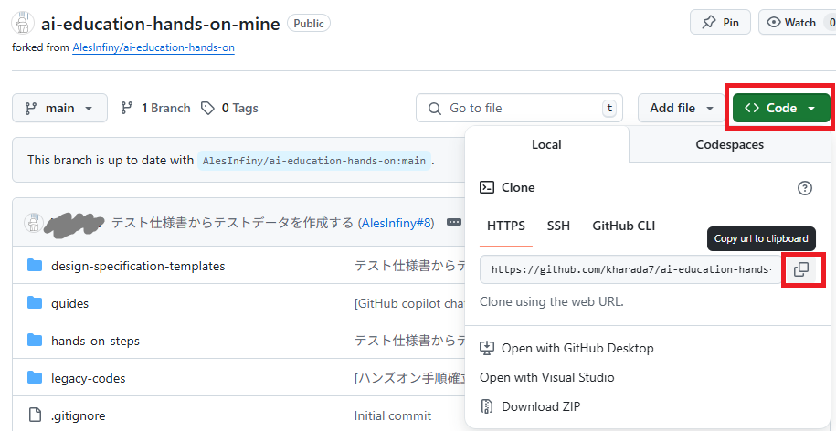
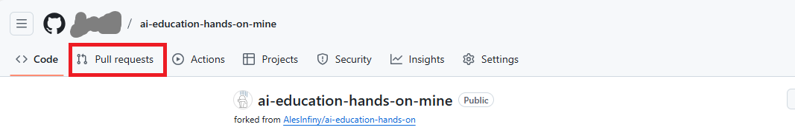
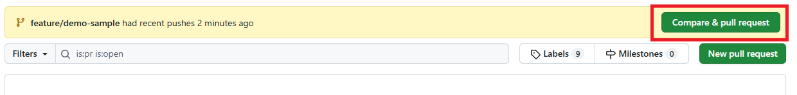
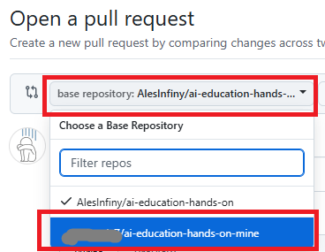
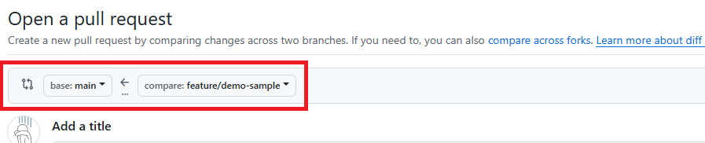
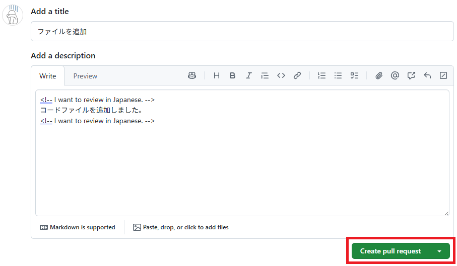
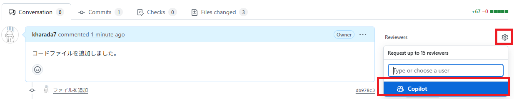

# 付録：リポジトリをフォークしてプルリクエストを作成する手順

## 前提

- [GitHub](https://github.com/) にアカウントを持っており、自分のリポジトリを作成できること
- ローカル環境に Git for Windows の最新バージョンがインストールされており、リポジトリのクローンやコミット・プッシュができる状態であること

## リポジトリのフォーク

1. ブラウザーで [ai-education-hands-on](https://github.com/AlesInfiny/ai-education-hands-on) にアクセスし、リポジトリ名（ ai-education-hands-on ）右側の "Fork" 横の矢印を展開し、 "Create a new fork" を選択します。

    

1. "Create a new fork" 画面が表示されるので、以下を入力して "Create fork" をクリックします。
    - "Owner" を自分のアカウントに設定する
    - "Repository name" に適当な名前を入力する
    - **"Copy the main branch only" にチェックを入れる（重要）**

    

## コードの編集・追加

1. フォークに成功するとフォークしたリポジトリの画面が表示されるので、画面上部の "Code" をクリックし、表示された URL の右側のアイコンをクリックします。リポジトリの URL がクリップボードにコピーされます。

    

1. ローカル環境の適当なフォルダーで以下のコマンドを実行します。

    ```bash
    git clone [上の手順でコピーした URL]
    ```

1. ローカル環境にリポジトリの内容がクローンされます。

1. 以下のコマンドでブランチを作成し移動します。

    ```bash
    git switch -c "[ブランチ名]"
    ```

1. フォルダーやコードファイルを追加します。

1. 以下のコマンドでコミット・プッシュします。

    ```bash
    # すべての追加したファイルやディレクトリをインデックスに登録
    git add -A
    # コミットを実行
    git commit -m "[コミットコメント]" 
    # プッシュを実行
    git push -u origin "[ブランチ名]"
    ```

## プルリクエストの作成

1. ブラウザーで再度フォークしたリポジトリにアクセスし、画面上部の "Pull requests" をクリックします。

    

1. 表示された画面で "Compare & pull request" をクリックします。

    

    **注意** : プッシュが成功したにもかかわらず "Compare & pull request" が表示されていない場合、フォークしたリポジトリではなく元の `ai-education-hands-on` を見ている可能性があります。画面左上のリポジトリ名をよく確認してください。

1. **この手順は非常に重要です。必ず実施してください。**

    **"base repository" をクリックし、自分のリポジトリを選択しなおします。**

    

1. 以下のようにリポジトリ名が切り替わったら成功です。

    

1. title と description を入力します。 GitHub Copilot に日本語でレビューしてほしい場合、 description の前後に `<!-- I want to review in Japanese. -->` と入力します。
    "Create pull request" をクリックします。

    

1. プルリクエストが作成されます。画面右側の "Reviewers" 右の歯車アイコンをクリックし、 Copilot を選択します。

    

1. しばらく待つと、 GitHub Copilot によるレビューコメントが書き込まれます。手順はこれで終了です。
