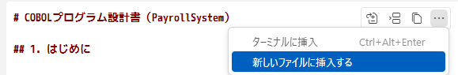

# レガシーコードから設計書をリバースする

1. GitHub Copilot Chat を開きます。
1. GitHub Copilot に次の質問をします。なお、 `#` のファイル名部分が認識されない場合は、プロンプトに `#` を手入力してファイルを指定してください。

    ```plaintext
    #design-specification-template.md に基づいて、 #legacy-codes/main.cobc の設計書を作成してください。なお、「6. 詳細処理」では、できる限り項目名ではなく項目論理名を使用してください。
    ```

1. GitHub Copilot によって作成された回答の右上の `...` をクリックし、「新しいファイルに挿入する」を選択します。

    

    新しいファイルに挿入したとき、回答内容が最後まで反映されないことがあります。その場合は回答をコピー＆ペーストしてください。

1. `designdoc-main.md` というファイル名を入力し、保存します。
