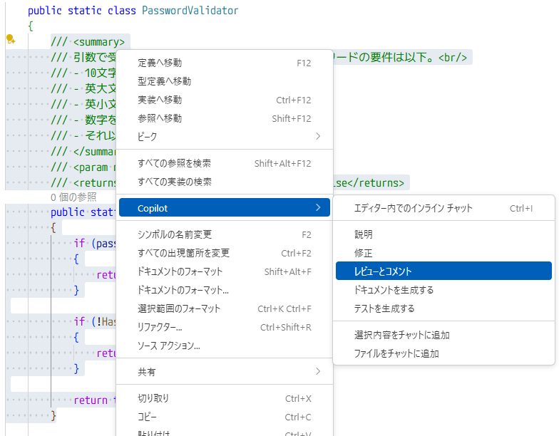

# コードレビューで GitHub Copilot を活用する - VS Code 編 -

1. VS Code で [レビュー用のサンプルコード (PasswordValidator.cs)](../code-examples/PasswordValidator.cs) を開きます。
1. PasswordValidator.cs の 5 行目から 28 行目を選択状態にし、右クリックして「 Copilot 」→「レビューとコメント」の順に選択します。
    
1. PasswordValidator.cs の エディター上にレビューコメントと「変更する提案」が表示されます。「適用して次へ移動」または「適用」を押下します。
    提案がコードに適用されます。
1. レビューコメントが複数ある場合、次のコメントが表示されます。同様に「適用して次へ移動」または「適用」を押下し、変更を適用します。
1. すべてのレビューコメントの内容を適用したら、 `CTRL` + `S` でファイルを保存します。

<details>
<summary>GitHub Copilot のレビューコメント例</summary>

```plaintext
ドキュメントコメントで「10文字以上」と記載されていますが、実装では8文字以上（Line 17: password.Length < 8）になっています。要件と実装が一致していません。
```

</details>
